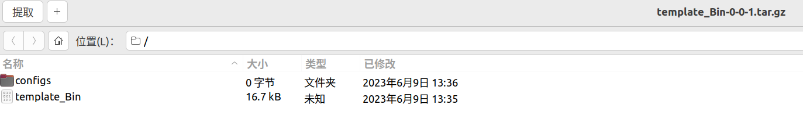

Abuild插件功能测试说明北京锦鸿希电信息技术股份有限公司 

<!--敲几个回车-->
        
<!--标题调整，在这里选择你想要的字号和字体-->
    
        Abuild插件功能测试说明
         
    
<!--敲几个回车-->
           
<!--敲几个回车-->
           
    
    编制/日期：___________________
    <!--内容自己改--> 
    审核/日期：___________________
    <!--内容自己改--> 
    复核/日期：___________________
    <!--内容自己改--> 
    批准/日期：___________________
    <!--内容自己改--> 
         
         
         
            
        <!--敲几个回车-->    
    
    
        北京锦鸿希电信息技术股份有限公司文档
            
    

Abuild插件功能测试说明北京锦鸿希电信息技术股份有限公司 

- [1. 概述](#1-概述)
- [2. 环境准备](#2-环境准备)
- [3. 功能验证](#3-功能验证)
  - [3.1. 编译器选择测试大项](#31-编译器选择测试大项)
    - [3.1.1. compilersitem.json生成测试](#311-compilersitemjson生成测试)
      - [3.1.1.1. 说明](#3111-说明)
      - [3.1.1.2. 操作步骤](#3112-操作步骤)
      - [3.1.1.3. 通过标准](#3113-通过标准)
      - [3.1.1.4. 参考效果](#3114-参考效果)
  - [3.2. compilersitem.json的设置测试](#32-compilersitemjson的设置测试)
      - [3.2.1. 说明](#321-说明)
      - [3.2.2. 操作步骤](#322-操作步骤)
      - [3.2.3. 通过标准](#323-通过标准)
      - [3.2.4. 参考效果](#324-参考效果)
    - [编译器选择后的保存测试](#编译器选择后的保存测试)
      - [3.2.5. 说明](#325-说明)
      - [3.2.6. 操作步骤](#326-操作步骤)
      - [3.2.7. 通过标准](#327-通过标准)
      - [3.2.8. 参考效果](#328-参考效果)
    - [编译器选择后clangd设置重新生成测试](#编译器选择后clangd设置重新生成测试)
      - [3.2.9. 说明](#329-说明)
      - [3.2.10. 操作步骤](#3210-操作步骤)
      - [3.2.11. 通过标准](#3211-通过标准)
      - [3.2.12. 参考效果](#3212-参考效果)
  - [3.3. 智能提示测试大项](#33-智能提示测试大项)
    - [3.3.1. .h提示测试](#331-h提示测试)
      - [3.3.1.1. 说明](#3311-说明)
      - [3.3.1.2. 操作步骤](#3312-操作步骤)
      - [3.3.1.3. 通过标准](#3313-通过标准)
      - [3.3.1.4. 参考效果](#3314-参考效果)
    - [3.3.2. 新创建的文件是否能得到之前的文件内容的提示测试](#332-新创建的文件是否能得到之前的文件内容的提示测试)
      - [3.3.2.1. 说明](#3321-说明)
      - [3.3.2.2. 操作步骤](#3322-操作步骤)
      - [3.3.2.3. 通过标准](#3323-通过标准)
      - [3.3.2.4. 参考效果](#3324-参考效果)
    - [3.3.3. 之前的文件对新加入的头文件，以及函数的引用智能提示测试](#333-之前的文件对新加入的头文件以及函数的引用智能提示测试)
      - [3.3.3.1. 说明](#3331-说明)
      - [3.3.3.2. 操作步骤](#3332-操作步骤)
      - [3.3.3.3. 通过标准](#3333-通过标准)
      - [3.3.3.4. 参考效果](#3334-参考效果)
  - [3.4. 创建工程测试大项](#34-创建工程测试大项)
    - [3.4.1. 新创建工程测试](#341-新创建工程测试)
      - [3.4.1.1. 说明](#3411-说明)
      - [3.4.1.2. 操作步骤](#3412-操作步骤)
      - [3.4.1.3. 通过标准](#3413-通过标准)
      - [3.4.1.4. 参考效果](#3414-参考效果)
    - [3.4.2. 为现有源码添加工程](#342-为现有源码添加工程)
      - [3.4.2.1. 说明](#3421-说明)
      - [3.4.2.2. 操作步骤](#3422-操作步骤)
      - [3.4.2.3. 通过标准](#3423-通过标准)
      - [3.4.2.4. 参考效果](#3424-参考效果)
  - [3.5. 编译类型，输出类型设置测试](#35-编译类型输出类型设置测试)
    - [3.5.1. 编译类型设置测试](#351-编译类型设置测试)
      - [3.5.1.1. 说明](#3511-说明)
      - [3.5.1.2. 操作步骤](#3512-操作步骤)
      - [3.5.1.3. 通过标准](#3513-通过标准)
      - [3.5.1.4. 参考效果](#3514-参考效果)
    - [3.5.2. 输出类型设置测试](#352-输出类型设置测试)
      - [3.5.2.1. 说明](#3521-说明)
      - [3.5.2.2. 操作步骤](#3522-操作步骤)
      - [3.5.2.3. 通过标准](#3523-通过标准)
      - [3.5.2.4. 参考效果](#3524-参考效果)
  - [3.6. 打包测试大项](#36-打包测试大项)
    - [3.6.1. 打包可执行文件测试](#361-打包可执行文件测试)
      - [3.6.1.1. 说明](#3611-说明)
      - [3.6.1.2. 操作步骤](#3612-操作步骤)
      - [3.6.1.3. 通过标准](#3613-通过标准)
      - [3.6.1.4. 参考效果](#3614-参考效果)
    - [3.6.2. 动态库静态库文件测试](#362-动态库静态库文件测试)
      - [3.6.2.1. 说明](#3621-说明)
      - [3.6.2.2. 操作步骤](#3622-操作步骤)
      - [3.6.2.3. 通过标准](#3623-通过标准)
      - [3.6.2.4. 参考效果](#3624-参考效果)
    - [3.6.3. 打包更新测试](#363-打包更新测试)
      - [3.6.3.1. 说明](#3631-说明)
      - [3.6.3.2. 操作步骤](#3632-操作步骤)
      - [3.6.3.3. 通过标准](#3633-通过标准)
      - [3.6.3.4. 参考效果](#3634-参考效果)
  - [3.7. 编译测试](#37-编译测试)
      - [3.7.1. 说明](#371-说明)
      - [3.7.2. 操作步骤](#372-操作步骤)
      - [3.7.3. 通过标准](#373-通过标准)
      - [3.7.4. 参考效果](#374-参考效果)
  - [3.8. 运行测试](#38-运行测试)
      - [3.8.1. 说明](#381-说明)
      - [3.8.2. 操作步骤](#382-操作步骤)
      - [3.8.3. 通过标准](#383-通过标准)
      - [3.8.4. 参考效果](#384-参考效果)
  - [3.9. 仿真测试](#39-仿真测试)
    - [3.9.1. 本地仿真测试](#391-本地仿真测试)
      - [3.9.1.1. 说明](#3911-说明)
      - [3.9.1.2. 操作步骤](#3912-操作步骤)
      - [3.9.1.3. 通过标准](#3913-通过标准)
      - [3.9.1.4. 参考效果](#3914-参考效果)
    - [3.9.2. 远程仿真测试](#392-远程仿真测试)
      - [3.9.2.1. 说明](#3921-说明)
      - [3.9.2.2. 操作步骤](#3922-操作步骤)
      - [3.9.2.3. 通过标准](#3923-通过标准)
      - [3.9.2.4. 参考效果](#3924-参考效果)
  - [3.10. 清除测试](#310-清除测试)
      - [3.10.1. 说明](#3101-说明)
      - [3.10.2. 操作步骤](#3102-操作步骤)
      - [3.10.3. 通过标准](#3103-通过标准)
      - [3.10.4. 参考效果](#3104-参考效果)
  - [3.11. 重启语言服务器测试](#311-重启语言服务器测试)
      - [3.11.1. 说明](#3111-说明-1)
      - [3.11.2. 操作步骤](#3112-操作步骤-1)
      - [3.11.3. 通过标准](#3113-通过标准-1)
      - [3.11.4. 参考效果](#3114-参考效果-1)
  - [3.12. 插件设置项测试](#312-插件设置项测试)
      - [3.12.1. 说明](#3121-说明)
      - [3.12.2. 操作步骤](#3122-操作步骤)
      - [3.12.3. 通过标准](#3123-通过标准)
      - [3.12.4. 参考效果](#3124-参考效果)
  - [3.12. 性能测试](#312-性能测试)
      - [3.12.1. 说明](#3121-说明-1)
      - [3.12.2. 操作步骤](#3122-操作步骤-1)
      - [3.12.3. 通过标准](#3123-通过标准-1)
      - [3.12.4. 参考效果](#3124-参考效果-1)

文档编辑历史
| 时间     | 版本 | 编辑人 | 说明 |
| ------   | :----: | ----: |:--- |
| 20230609    | v0.1     | 杨康     |初版 |
|      |      |      | |
|  |      |    | |

# 1. 概述
本文档是对vscode的插件abuild的测试说明文档，描述abuild插件功能的测试方法，用于测试abuild插件时进行参考。

# 2. 环境准备
参照《linux下c-c++开发指南-abuild》。

# 3. 功能验证
## 3.1. 编译器选择测试大项

### 3.1.1. compilersitem.json生成测试
#### 3.1.1.1. 说明

compilersitem.json的插件加载时生成测试，编译器选择按钮中的选项来自，".local/share/abuild/compilersitem.json"，compilersitem.json会在插件首次加载时自动生成。
#### 3.1.1.2. 操作步骤
删除.local/share/abuild/compilersitem.json，加载插件，查看是否自动生成
#### 3.1.1.3. 通过标准
.local/share/abuild/compilersitem.json重新生成
#### 3.1.1.4. 参考效果

## 3.2. compilersitem.json的设置测试
#### 3.2.1. 说明
通过abuild.compilersEdit命令可以对可选编译器进行设置，设置后，可通过编译器选择按钮进行编译器选择
#### 3.2.2. 操作步骤
执行abuild.compilersEdit命令，进行编译器增加编辑，保存后，点击编译器选择按钮

#### 3.2.3. 通过标准
可选择设置的编译器
#### 3.2.4. 参考效果

### 编译器选择后的保存测试
#### 3.2.5. 说明
选择编译器后，当前工程的编译器将会被保存到工程目录下的.abuild/interface.json中
#### 3.2.6. 操作步骤
点击编译器选择按钮（compilerTool）选择编译器后，查看.abuild/interface.json中的

#### 3.2.7. 通过标准
.abuild/interface.json中变为选择的编译器
#### 3.2.8. 参考效果

### 编译器选择后clangd设置重新生成测试
#### 3.2.9. 说明
选择编译器后将会刷新.clangd
#### 3.2.10. 操作步骤
切换编译器，查看工程目录下.clangd是否重新生成，查看文件的智能提示是否正常

#### 3.2.11. 通过标准
.clangd变为新编译器参数
#### 3.2.12. 参考效果

## 3.3. 智能提示测试大项
备注：之前的文件指，编译器目录下的头文件目录，工程目录下的文件

### 3.3.1. .h提示测试
#### 3.3.1.1. 说明
在新建的文件中，应可提示已有.h文件
#### 3.3.1.2. 操作步骤
新建目录，新建.c与.cpp文件，进行include编码，查看是否有之前的.h文件提示
#### 3.3.1.3. 通过标准
有提示
#### 3.3.1.4. 参考效果

### 3.3.2. 新创建的文件是否能得到之前的文件内容的提示测试
#### 3.3.2.1. 说明
新建的文件是否能被提示已有函数
#### 3.3.2.2. 操作步骤
新建目录，新建.c与.cpp文件，在内部进行编码，编写之前文件中的函数，查看是否有之前的文件的内容提示
#### 3.3.2.3. 通过标准
有提示
#### 3.3.2.4. 参考效果

### 3.3.3. 之前的文件对新加入的头文件，以及函数的引用智能提示测试
#### 3.3.3.1. 说明
新加文件有新函数，新头文件，在之前的文件中引用新函数，新头文件，查看是否有智能提示
#### 3.3.3.2. 操作步骤
创建新目录新文件后，在之前的文件中引用新函数，查看是否有智能提示
#### 3.3.3.3. 通过标准
可以看到智能提示
#### 3.3.3.4. 参考效果

## 3.4. 创建工程测试大项

### 3.4.1. 新创建工程测试
#### 3.4.1.1. 说明
创建工程是abuild的最基本功能，可以在一个目录下创建一个样板工程
#### 3.4.1.2. 操作步骤
ctrl + shift + p执行创建工程命令，查看是否在工作目录下创建了.abuild文件夹，并在文件下内生成abuild.json与interface.json文件，工程目录下生成.gitignore与.clangd文件，mian.cpp文件
用vscode打开一个新建的文件夹，执行创建工程命令

#### 3.4.1.3. 通过标准
在工作目录下创建了.abuild文件夹，并在文件下内生成abuild.json与interface.json文件，工程目录下生成.gitignore与.clangd文件，mian.cpp文件
#### 3.4.1.4. 参考效果

### 3.4.2. 为现有源码添加工程
#### 3.4.2.1. 说明
为现有源码添加abuild工程管理
#### 3.4.2.2. 操作步骤
打开现有源码文件夹，执行创建工程命令

#### 3.4.2.3. 通过标准
在工作目录下创建了.abuild文件夹，并在文件下内生成abuild.json与interface.json文件，工程目录下生成.gitignore与.clangd文件，mian.cpp文件
#### 3.4.2.4. 参考效果

## 3.5. 编译类型，输出类型设置测试

### 3.5.1. 编译类型设置测试
#### 3.5.1.1. 说明
设置编译类型，执行编译可以得到不同的输出
#### 3.5.1.2. 操作步骤
进行编译类型release与debug的切换，查看interface.json的变化，点击编译build按钮查看输出目录是否为编译类型对应的输出目录，debug对应debug目录，release目录对应release目录

#### 3.5.1.3. 通过标准
对应生成成功
#### 3.5.1.4. 参考效果

### 3.5.2. 输出类型设置测试
#### 3.5.2.1. 说明
不同的输出类型，可以控制输出可执行文件、动态库、静态库
#### 3.5.2.2. 操作步骤
设置不同的输出类型，查看输出目录是否对应，动态对应.so，静态对应.a，可执行文件对应可执行文件，其名字与工程名字相同

#### 3.5.2.3. 通过标准
输出目录输出动态.so，静态.a，可执行文件，其名字与工程名字相同
#### 3.5.2.4. 参考效果

## 3.6. 打包测试大项

### 3.6.1. 打包可执行文件测试
#### 3.6.1.1. 说明
打包命令可以根据输出类型做不同打包
#### 3.6.1.2. 操作步骤
切换输出类型到可执行文件，进行编译，在abuild.json中设置packPath，执行打包命令，输出目录查看压缩包，是否存在可执行文件和packPath

#### 3.6.1.3. 通过标准
存在
#### 3.6.1.4. 参考效果

### 3.6.2. 动态库静态库文件测试
#### 3.6.2.1. 说明
打包命令可以根据输出类型做不同打包
#### 3.6.2.2. 操作步骤
切换输出类型到动态库或静态库，进行编译，在abuild.json中设置packPath，执行打包命令，输出目录packdir目录下查看压缩包，是否存在可执行文件和packPath

#### 3.6.2.3. 通过标准
存在
#### 3.6.2.4. 参考效果

### 3.6.3. 打包更新测试
#### 3.6.3.1. 说明
打包后，如果原文件变化，则再次打包，相应文件得到更新，被删除的文件被删除
#### 3.6.3.2. 操作步骤
更新工程目录下的文件夹，查看打包情况，是否能够适应更新

#### 3.6.3.3. 通过标准
可执行文件，动态库，静态库都对应更新
#### 3.6.3.4. 参考效果
aa.json存在是

删除aa.json后

## 3.7. 编译测试
#### 3.7.1. 说明
编译可以进行编译类型、输出类型设置
#### 3.7.2. 操作步骤
点击编译按钮，查看是否按所选编译器/编译类型/输出类型进行编译输出
#### 3.7.3. 通过标准
按所选编译器/编译类型/输出类型进行了编译输出
#### 3.7.4. 参考效果

## 3.8. 运行测试
#### 3.8.1. 说明
点击运行按钮，可在终端运行程序
#### 3.8.2. 操作步骤
点击运行按钮，查看是否在终端输出程序运行结果
#### 3.8.3. 通过标准
输出程序运行结果
#### 3.8.4. 参考效果

## 3.9. 仿真测试

### 3.9.1. 本地仿真测试
#### 3.9.1.1. 说明
本地仿真在使用本机编译器时
#### 3.9.1.2. 操作步骤
点击本地仿真按钮，查看是否切换到程序入口，并切换为终端显示

#### 3.9.1.3. 通过标准
断点到程序入口
#### 3.9.1.4. 参考效果

### 3.9.2. 远程仿真测试
#### 3.9.2.1. 说明
远程仿真一般用于交叉编译时
#### 3.9.2.2. 操作步骤
在远程主机执行`gdbserver 192.168.239.128:1234 ./template_Bin`,启动server，设置abuild.json中的服务器地质，点击远程仿真按钮，进行远程仿真，查看是否切换到程序入口，并切换为终端显示

#### 3.9.2.3. 通过标准
断点到程序入口
#### 3.9.2.4. 参考效果

## 3.10. 清除测试
#### 3.10.1. 说明
清楚按钮可以清楚工程输出
#### 3.10.2. 操作步骤
点击清除按钮，查看对应的编译类型输出文件夹是否被删除

#### 3.10.3. 通过标准
删除了shadow输出目录
#### 3.10.4. 参考效果

## 3.11. 重启语言服务器测试
#### 3.11.1. 说明
用于智能提示故障时，通过重启语言服务器，刷新智能提示
#### 3.11.2. 操作步骤
ctrl+ shift + p，执行abuild重启语言服务器命令

#### 3.11.3. 通过标准
智能提示刷新
#### 3.11.4. 参考效果
横线是智能提示

## 3.12. 插件设置项测试
#### 3.12.1. 说明
abuild有三个设置项
Whether to refresh the smart prompt after compilation?
是否在每次编译后重启智能提示（语言服务器）

Do you want to refresh the smart prompt after selecting the compilation type?
是否在选择编译类型后重启智能提示（语言服务器）

Whether to refresh the smart prompt after selecting the compiler?
是否在选择编译器后重启智能提示（语言服务器）

默认都是开启的，但是由于语言服务器经常重启容易崩溃，我们也可以手动关闭一些重启
#### 3.12.2. 操作步骤

#### 3.12.3. 通过标准
通过开启、关闭重启选项，查看事件（编译，选择编译类型，选择编译器）后，智能提示是否重启
#### 3.12.4. 参考效果
智能提示重启的效果是，横线消失又出现

## 3.12. 性能测试
#### 3.12.1. 说明
多abuild的编译能力的测试，不断增加源文件数，测试其编译能力上限
#### 3.12.2. 操作步骤

#### 3.12.3. 通过标准

#### 3.12.4. 参考效果
